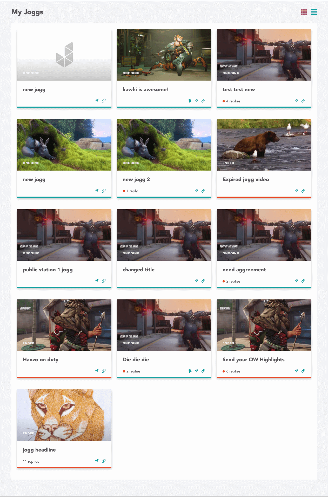
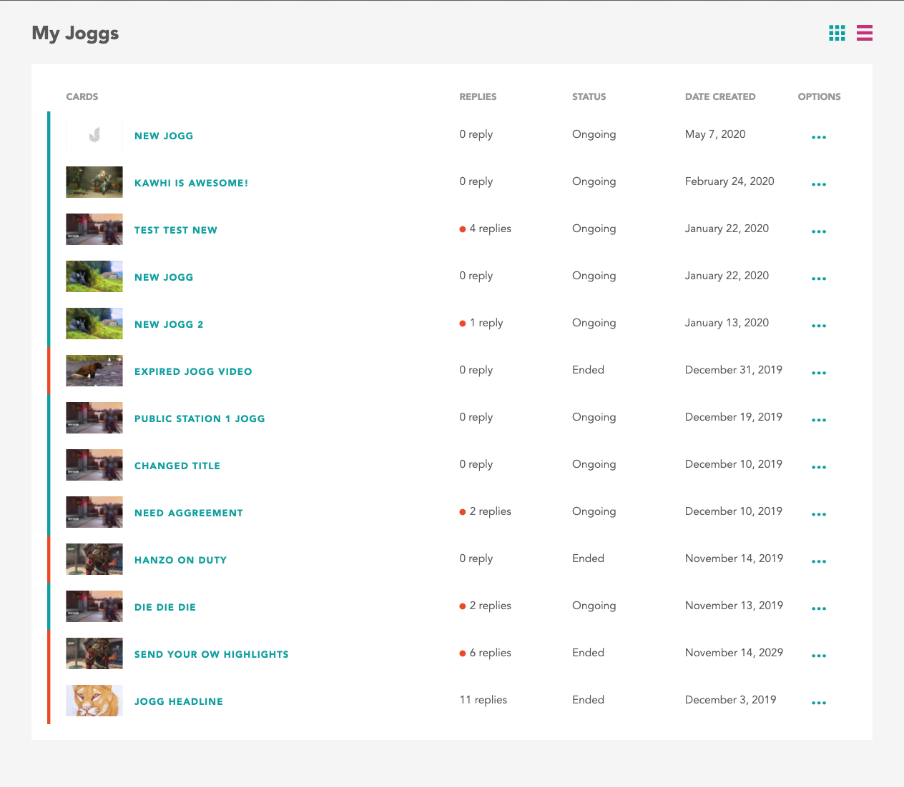

# Jogg Coding Challenge

This coding challenge is to build a list of cards with two different views.

## Project Setup

This is a basic site scaffold using Next.js and React. Feel free to read the docs at [Next.js](https://nextjs.org/docs/getting-started). You shouldn't touch `pages/api/cards` and `/data.js`, these two files are used to mock api for `/api/cards`.

Install it and run:

```bash
npm install
npm run dev
# or
yarn
yarn dev
```

## Challenge

1. Retrieve data from `/api/cards` after run `yarn dev`
1. Build the page
1. Create Grid card
1. Create List card
1. Add toggle functionality




## Details

- Feel free to add any package or library to complete this challenge
- All the svgs are provided in `/svgs`
- Don't worry about the font, use any font that you'll like
- Colors:
  - background: `#F5F5F5`
  - Gray: `#59595B`
  - Red Violet: `#C5327B`
  - Persian Green: `#0EA0A0`
  - Cinnabar: `#EA4A26`

## Bonus

- Use typescript 🤓
- Use emotion css library
- Add a loading state before loading the cards
- Use [swr](https://swr.now.sh/) to fetch the data
